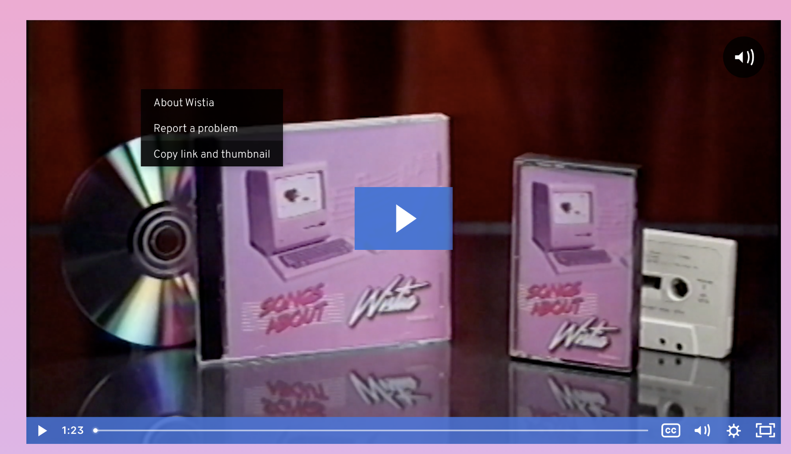
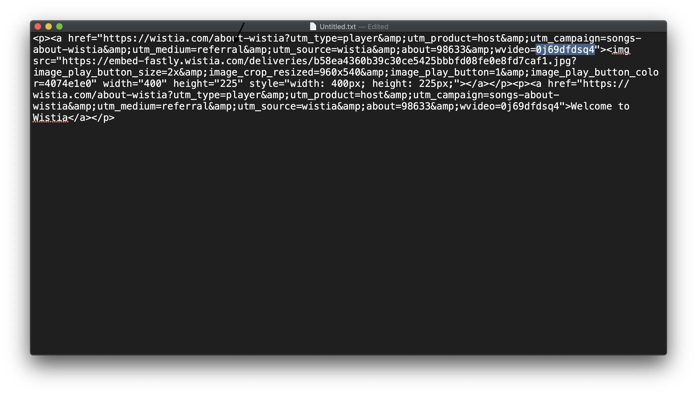

# wistia-dl
You can use this tool to download videos hosted on the [Wistia](https://wistia.com/) platform.

## Download
You can find the precompiled binaries in the Relases page. (Not available yet. See "Build from Source")
## Usage
The command is quite simple: `wistia-dl -v <video_id> -i <output_file_name>`.

To find the video ID, use these steps:

1. Right click on the video and choose "Copy link and thumbnail".

2. Paste the copied text in a text editor and find the video ID. Look for `"wvideo="`. Video ID comes after that text.

## Build from Source
1. Install Go.
2. Clone the project.
3. Run the `build.sh`. It will generate binary files for macOS, Linux, and Windows in the `output` folder.
